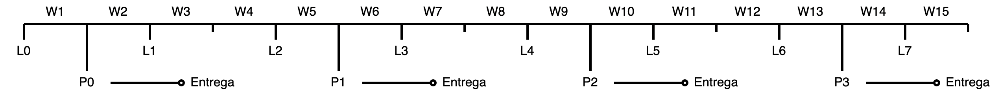

# Switched-On Leibnitz 

Material de laboratorio *Calculo diferencial e integral*. Prof. Armando Benjamin Cruz Hinojosa (Gory).

## ¿Qué es SwitchedOn Leibnitz?

SwitchedOn Leibniz es un compendio de jupyter notebooks con el objetivo de complementar los cursos teóricos de Cálculo diferencial e integral de la Facultad de ciencias de la UNAM, enseñando aplicaciones computacionales de los resultados principales del temario oficial de estos cursos.

Es común que los cursos semestrales de cálculo estén atestados de temas por ser una materia fundamental para la formación de alumnos de ciencias, y agregar este contenido al plan de estudios pareciera solo aumentar el peso de la clase. Pero la intención detras de este proyecto es el de presentar una alternativa a la enseñanza clásica del tema, que mediante ejercicios y prácticas el alumno se enfrente a questionamientos fundamentales y se genere una discusión en clase, profundizando así en los conceptos básicos.

## Contenido del repo

Para cada curso de cálculo se dispone una carpeta con tres tipos de materiales:

- Laboratorios: Actividad guiada, para explicar un tema y experimentar el funcionamiento de un algoritmo o teorema.
- Practicas: Hojas de ejercicios para la evaluación del curso.
- Proyectos: Propuestas de proyecto de exposición final.

## Calendario

Se plantea asignar un día de clase cada semana para un **laboratorio de cálculo**, donde el ayudante de laboratorio impartirá a lxs alumnxs la actividad guiada correspondiente a esa semana. La siguiente semana se resolverán dudas de la práctica de laboratorio. Después, el ayudante impartirá un segundo laboratorio de menor extensión para reforzar conceptos básicos de programación. La cuarta semana se entrega la práctica y no se imparte laboratorio de cálculo.

Esta dinámica mensual se repite 4 veces en el semestre. En caso de decidir hacer un proyecto de exposición final, se puede reemplazar la práctica 3 y dar una semana más de tiempo para las exposiciones.
